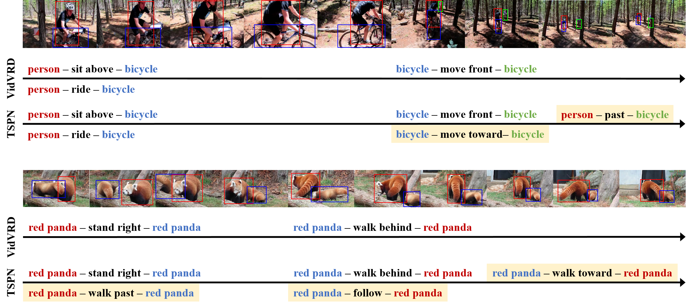

# Temporal Span Proposal Network for Video Relation Detection
Implementation of ["What and When to Look?: Temporal Span Proposal Network for Video Visual Relation Detection"](https://arxiv.org/pdf/2107.07154.pdf)


<div style="color:#0000FF" align="center">

</div>


Identifying relations between objects is central to understanding the scene. While several works have been proposed for relation modeling in the image domain, there have been many constraints in the video domain due to challenging dynamics of spatio-temporal interactions (e.g., Between which objects are there an interaction? When do relations occur and end?). To date, two representative methods have been proposed to tackle Video Visual Relation Detection (VidVRD): segment-based and window-based. We first point out the limitations these two methods have and propose **Temporal Span Proposal Network (TSPN)**, a novel method with two advantages in terms of efficiency and effectiveness. **1) TSPN tells what to look**: it sparsifies relation search space by scoring relationness (i.e., confidence score for the existence of a relation between pair of objects) of object pair. **2) TSPN tells when to look**: it leverages the full video context to simultaneously predict the temporal span and categories of the entire relations. TSPN demonstrates its effectiveness by achieving new state-of-the-art by a significant margin on two VidVRD benchmarks (ImageNet-VidVDR and VidOR) while also showing lower time complexity than existing methods - in particular, twice as efficient as a popular segment-based approach.

## Video Visual Realtion Detection (VidVRD) & Video Object Relation (VidOR)
- [x] Dataset & Annotations (VidVRD & VidOR)
- [x] Preprocessing (videos -> frames)
- [x] Aannotations -> COCO format
- [x] Object Detection w/ Faster R-CNN
- [x] Multi Object Tracking w/ DeepSORT
- [ ] Relation Detection Baseline

### Dataset & Annotations
* VidVRD dataset can be found in [here](https://xdshang.github.io/docs/imagenet-vidvrd.html).
* VidOR dataset can be found in [here](https://xdshang.github.io/docs/vidor.html).

### Preprocessing videos into frames
* For VidVRD, use `vidvrd_to_image.sh` (will take about 1 hour).
* For VidOR, use `vidor_to_image.sh` (will take about 7-8 hours).

### Annotation format
The VidVRD json file contains a dictionary sturctured like:
```
{
    "video_id": "ILSVRC2015_train_00010001",        # Video ID from the original ImageNet ILSVRC2016 video dataset
    "frame_count": 219,
    "fps": 30, 
    "width": 1920, 
    "height": 1080, 
    "subject/objects": [                            # List of subject/objects
        {
            "tid": 0,                               # Trajectory ID of a subject/object
            "category": "bicycle"
        }, 
        ...
    ], 
     "trajectories": [                              # List of frames
        [                                           # List of bounding boxes in each frame
            {
                "tid": 0,                       
                "bbox": {
                    "xmin": 672,                    # left
                    "ymin": 560,                    # top
                    "xmax": 781,                    # right
                    "ymax": 693                     # bottom
                }, 
                "generated": 0,                     # 0 - the bounding box is manually labeled
                                                    # 1 - the bounding box is automatically generated
            }, 
            ...
        ],
        ...
    ]
    "relation_instances": [                         # List of annotated visual relation instances
        {
            "subject_tid": 0,                       # Corresponding trajectory ID of the subject
            "object_tid": 1,                        # Corresponding trajectory ID of the object
            "predicate": "move_right", 
            "begin_fid": 0,                         # Frame index where this relation begins (inclusive)
            "end_fid": 210                          # Frame index where this relation ends (exclusive)
        }, 
        ...
    ]
}
```

The VidOR json file contains a dictionary sturctured like (both are identical except the "version", "video_hash", and "video_path"):
```
{
    "version": "VERSION 1.0",
    "video_id": "5159741010",                       # Video ID in YFCC100M collection
    "video_hash": "6c7a58bb458b271f2d9b45de63f3a2", # Video hash offically used for indexing in YFCC100M collection 
    "video_path": "1025/5159741010.mp4",            # Relative path name in this dataset
    "frame_count": 219,
    "fps": 29.97002997002997, 
    "width": 1920, 
    "height": 1080, 
    "subject/objects": [                            # List of subject/objects
        {
            "tid": 0,                               # Trajectory ID of a subject/object
            "category": "bicycle"
        }, 
        ...
    ], 
    "trajectories": [                               # List of frames
        [                                           # List of bounding boxes in each frame
            {                                       # The bounding box at the 1st frame
                "tid": 0,                           # The trajectory ID to which the bounding box belongs
                "bbox": {
                    "xmin": 672,                    # Left
                    "ymin": 560,                    # Top
                    "xmax": 781,                    # Right
                    "ymax": 693                     # Bottom
                }, 
                "generated": 0,                     # 0 - the bounding box is manually labeled
                                                    # 1 - the bounding box is automatically generated by a tracker
                "tracker": "none"                   # If generated=1, it is one of "linear", "kcf" and "mosse"
            }, 
            ...
        ],
        ...
    ],
    "relation_instances": [                         # List of annotated visual relation instances
        {
            "subject_tid": 0,                       # Corresponding trajectory ID of the subject
            "object_tid": 1,                        # Corresponding trajectory ID of the object
            "predicate": "in_front_of", 
            "begin_fid": 0,                         # Frame index where this relation begins (inclusive)
            "end_fid": 210                          # Frame index where this relation ends (exclusive)
        }, 
        ...
    ]
}
```

### Object Detector
We use off-the-shelf [Faster R-CNN](https://github.com/facebookresearch/detectron2/) equipped with ResNet-101 backbone.

* :warning: Need to convert VidVRD/VidOR annotations into COCO format!
    - For VidVRD, use `vidvrd_anno_to_coco_format.py` (will take a minute).
    - For VidOR, use `vidor_anno_to_coco_format.py` (will take few minutes).

### Multi Object Tracker
We use [DeepSORT](https://github.com/nwojke/deep_sort) for multi-object tracking.

### Relation Detection & Relation Tagging

* Train
```
sh train.sh
````

* Evaluation

```
sh eval.sh
```

## Citation
    @misc{woo2021look,
          title={{What and When to Look?: Temporal Span Proposal Network for Video Visual Relation Detection}}, 
          author={Sangmin Woo and Junhyug Noh and Kangil Kim},
          year={2021},
          eprint={2107.07154},
          archivePrefix={arXiv},
          primaryClass={cs.CV}
    }

## Acknowledgement

We appreciate much the nicely organized codes developed by [VidVRD-helper](https://github.com/xdshang/VidVRD-helper), [detectron2](https://github.com/facebookresearch/detectron2/), and [DeepSORT](https://github.com/nwojke/deep_sort). Our codebase is built mostly based on them.
